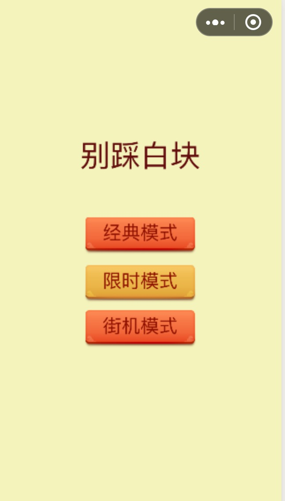
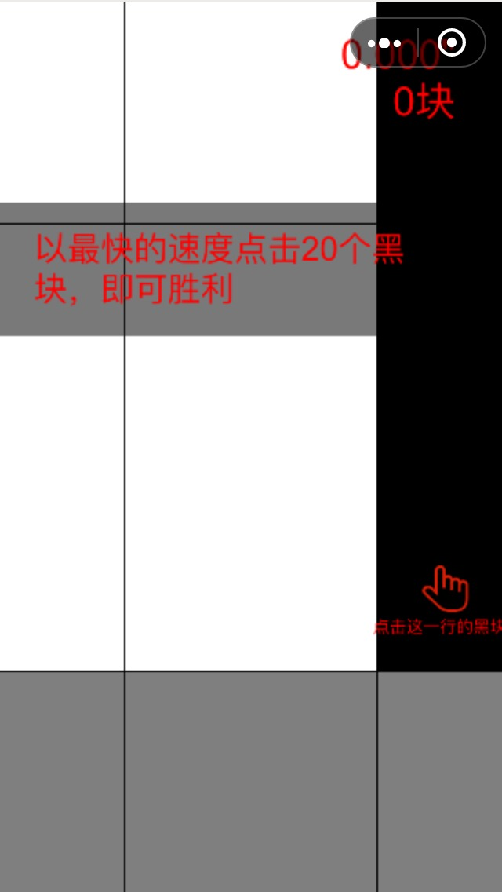
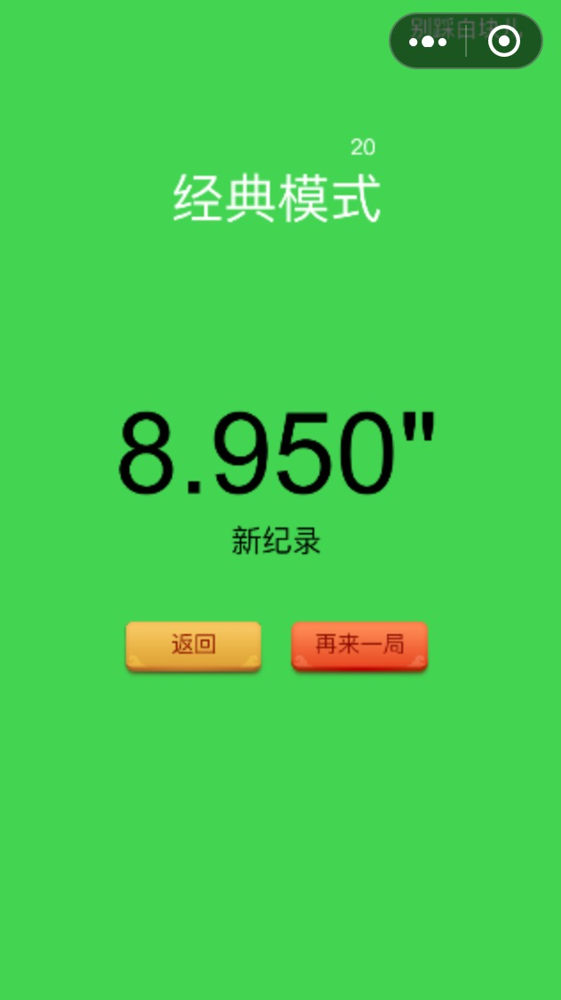
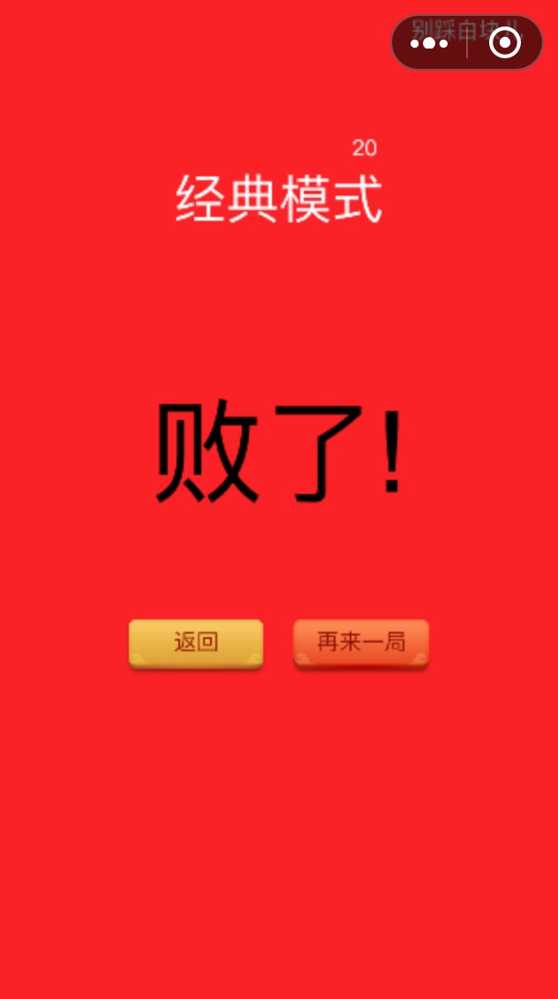

# donotTapWhite

A classical game —— "Do not tap the white block", developed by Cocos Creator.

It is a Cocos Creator project which can be built to WeChat game, web game, and native games.

## To run

Cocos Creator 1.8.0 or above is needed

## Snapshots

  
  
  
  

